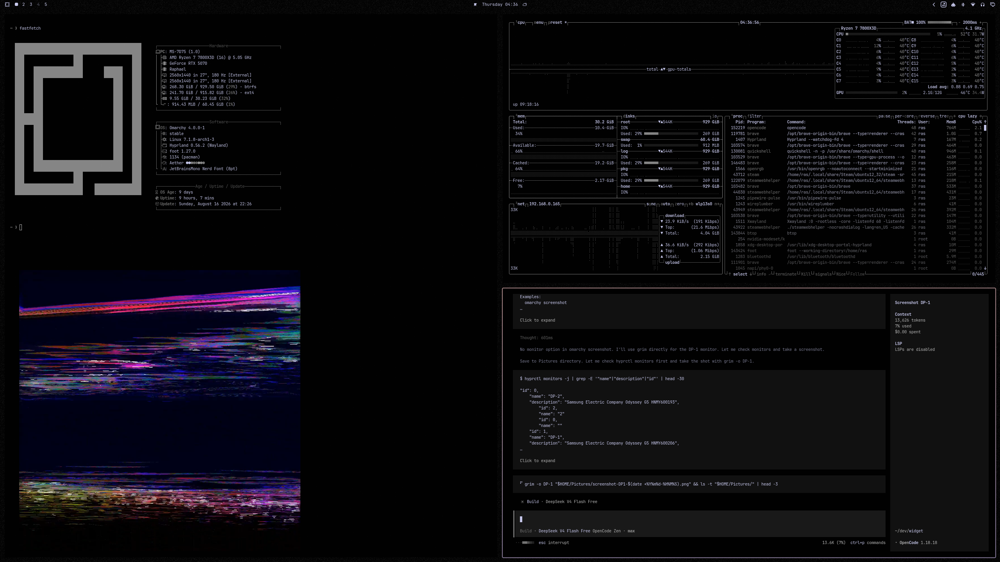

# Media Widget

A floating slideshow widget for the omarchy desktop: a draggable square that
plays photos, GIFs and videos from a folder you pick, always on top of your
desktop.

Originally a standalone C++/Qt desktop app, this is the omarchy plugin
rewrite. It is pure QML + shell scripts and needs no separate runtime.



## Features

- Plays photos, GIFs and videos (mp4, mov, m4v, webm, mkv, avi, jpg, png,
  gif, webp, bmp, avif, psd, psb) from any folder, recursively. Photoshop
  and other extra formats need the `kimageformats` package (`omarchy pkg add
  kimageformats`); unsupported files are skipped automatically.
- The folder is picked from the context menu with the normal folder picker
  (zenity, kdialog fallback).
- Draggable: grab the square with the left button and move it anywhere;
  the position persists in `shell.json` and is clamped to the screen.
  "Reset position" in the context menu returns it to the default corner.
- Hover controls: previous / pause-play / next buttons with tooltips, plus a
  slideshow interval slider (300–3600 s in the menu; hand-edited values
  between 5 s and 24 h are honored).
- Ken Burns zoom effect on photos (toggleable), plus an autoplay toggle for
  the interval advance.
- Live folder watching (inotify): dropping, removing or overwriting files
  rescans immediately, no restart needed.
- Bar toggle button (photo-frame icon) shows/hides the widget.
- Optional iCloud photo library sync — see `scripts/sync_icloud.sh`.

## Requirements

- omarchy (with the shell running) and Qt 6.2+ / Quickshell.
- `inotifywait` from `inotify-tools` for live folder watching (the widget
  keeps retrying if the tool or the folder is missing).
- `zenity` or `kdialog` for the folder picker.
- Coreutils (`base64`, `realpath`) for the scan pipeline.

## Install

Requires omarchy with the shell running. The plugin is cloned into
`~/.config/omarchy/plugins/`, validated against the plugin schema, and then
enabled (the plugin manager asks for confirmation and where to place the bar
button):

```
omarchy plugin add https://github.com/ras/widget-omarchy.git --enable
```

- `--enable` also places the bar button; without it, run
  `omarchy plugin enable io.github.ras.mediawidget` afterwards.
- `--yes` skips the confirmation prompt (scripted installs).
- `omarchy plugin install` is an alias of `add`.
- `add` takes a git URL only. For development against a local checkout, see
  Development below.

The add command rescans the plugin registry automatically; if the bar button
does not appear, restart omarchy-shell.

## Removal

```
omarchy plugin remove io.github.ras.mediawidget --yes
```

This asks for confirmation, disables the plugin (which removes its entry from
`~/.config/omarchy/shell.json`), unloads it from the running shell, and
deletes the plugin folder. Non-git installations are backed up to
`~/.config/omarchy/plugins/.io.github.ras.mediawidget.bak.<timestamp>` before
removal.

Optional cleanup of files the plugin may have created while in use:

```
rm -rf ~/Pictures/mediawidget      # default media folder (if you want it gone)
rm -rf ~/.config/mediawidget       # iCloud sync env (only if you used it)
```

## Configuration safety

- The plugin only ever touches its own `io.github.ras.mediawidget` entry in
  `~/.config/omarchy/shell.json`; it never modifies other bar/widget/plugin
  settings.
- That entry is written only on explicit user actions: dragging the widget,
  picking a folder, toggling shuffle/Ken Burns/autoplay, committing a slider,
  resetting the position, or choosing a size. A plain click that moves
  nothing writes nothing.
- Hand-edited values are honored: for example an `interval` below the menu
  slider's 300 s minimum is not reset to 300 by a later save, and a `0`
  margin is kept (only missing values fall back to the default).
- `omarchy plugin` commands (add/enable/remove) always prompt for
  confirmation before touching anything.

## Settings

Stored in the `bar.layout.right` entry of `~/.config/omarchy/shell.json`:

| Key            | Default                    | Meaning                          |
| -------------- | -------------------------- | -------------------------------- |
| `folder`       | `~/Pictures/mediawidget`   | Media folder (recursive)         |
| `interval`     | `300`                      | Slideshow interval in seconds    |
| `size`         | `360`                      | Widget size in pixels            |
| `radius`       | `0`                        | Corner radius in pixels (0..size/2) |
| `shuffle`      | `false`                    | Random order                     |
| `effects`      | `true`                     | Ken Burns zoom on photos         |
| `autoplay`     | `true`                     | Advance automatically on interval |
| `marginRight`  | `48`                       | Distance from right screen edge  |
| `marginBottom` | `48`                       | Distance from bottom screen edge |

## Controls

- Left-drag: move the widget (a plain click does nothing).
- Right-click: context menu (Pause/Previous/Next, shuffle, Ken Burns,
  autoplay, radius and interval sliders, Pick folder…, Open folder,
  Refresh folder, Retry media, Size…, Reset position, Hide widget).
- Hover the widget: previous / pause-play / next buttons and the current
  file name.
- Keyboard: click or tab to the widget first, then `Space` pause,
  `Left`/`Right` previous/next, `Esc` close (or close the menu when open).
  Tab reaches every control; Enter/Space activate; sliders move with arrows.
- Bar button: show / hide.
- The widget is hidden while the session is locked (omarchy lock service
  and Hyprland `lockactive` events are both tracked).

## Development

Everything below is also wired into the GitHub Actions workflow
(`.github/workflows/ci.yml`):

```
omarchy plugin validate ~/.config/omarchy/plugins/io.github.ras.mediawidget
./tests/run_tests.sh        # QML model tests + scan.sh + sync_icloud.sh
./tests/lint.sh             # qmllint over all QML files
```

Notes:

- `tests/run_tests.sh` runs `tst_media.qml` (MediaModel.js logic: scan
  parsing, path safety, failure skipping, lifecycle, status states,
  clamping) with the Qt 6 runner at `/usr/lib/qt6/bin/qmltestrunner`
  (`qmltestrunner` in `/usr/bin` is the Qt 5 one on this system).
- `tests/lint.sh` builds a temporary `qs/Commons`, `qs/Ui` layout so qmllint
  can resolve the shell modules (they live in a plain directory layout the
  dot-URI import cannot map directly). A few warning classes are known
  cosmetic noise shared with the omarchy shell's own plugins — unresolved
  `PanelWindow` members, `Color.menu.*`/`Color.tooltip.*` through
  `QtObject`-typed properties, and `QProcess::ExitStatus` in
  `Quickshell.Io`'s qmltypes. None of them affect the runtime. Note that
  `DragHandler.pressedChanged` used to be on this list too, but since Qt 6.11
  it is a real error: the signal no longer exists, and assigning it makes
  QML refuse to load the component (press state is tracked via
  `point.pressedButtons` instead).
- The shell scripts can additionally be checked with `bash -n`
  (`shellcheck` if you have it installed).

Debug IPC (while the shell runs):

```
omarchy-shell shell call io.github.ras.mediawidget widgetState ''
omarchy-shell shell call io.github.ras.mediawidget mediaCount ''
omarchy-shell shell call io.github.ras.mediawidget mediaFolder ''
```

## iCloud sync (optional)

`scripts/sync_icloud.sh` runs the `boredazfcuk/icloudpd` docker container and
downloads an iCloud photo library into the widget's folder every 24 h:

```
scripts/sync_icloud.sh init   # first login (Apple ID password + 2FA code)
scripts/sync_icloud.sh sync   # manual sync
```

The image is pinned to an audited immutable digest, the container and volume
carry an ownership label (only resources with that label are ever stopped or
removed), the config directory is created mode `0700` and the env file mode
`0600`, and an existing stopped container is restarted instead of a
conflicting one being started. The container runs with all capabilities
dropped, `no-new-privileges`, and memory/CPU/pids limits.

Edit `~/.config/mediawidget/icloudpd.env` to point `apple_id` (and, if you
have several libraries, `photo_library`) at your library. The widget itself
has no iCloud code — it just watches whatever folder it is pointed at.

## License

GPL-3.0-or-later